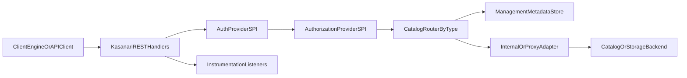

# Kasanari

Kasanari is a Java 21 + Quarkus service that exposes REST catalog APIs for:

- Apache Iceberg
- Apache Paimon
- Lance

Its main purpose is to provide a single operational layer for catalog APIs with:

- centralized catalog registration via Management API,
- a consistent auth/authz model across engines,
- pluggable SPI extensions,
- support for both internal and proxy catalog deployments.

Kasanari is conceptually similar to API-first catalog services such as Apache Gravitino and Apache Polaris in that it focuses on standardized REST surfaces and multi-engine interoperability.

## Core concepts

### Catalog operating modes

- `INTERNAL`: Kasanari owns the catalog metadata lifecycle and uses JDBC-backed repositories.
- `PROXY`: Kasanari forwards operations to upstream catalog implementations while keeping a unified API gateway and security layer.

### Core features

- **Internal catalog runtime** with catalog metadata in PostgreSQL-compatible storage.
- **Catalog proxy runtime** for existing external Iceberg/Paimon/Lance catalogs.
- **Management API** for create/get/update/delete catalog registrations.
- **Hot catalog reload** on metadata change (`kasanari.catalog.refresh-interval`, default `30s`).

### Additional features

- **Authentication SPI** with built-ins: `none`, `ldap`, `oidc`.
- **Authorization SPI** with built-ins: `allow-all`, `casbin`.
- **RBAC role bindings API** (`/management/v1/security/roles`).
- **Instrumentation listener SPI** for request auditing/logging and custom hooks.

## Implemented catalog versions

Kasanari tracks these catalog versions in runtime dependencies:

- Iceberg: `1.10.1`
- Paimon: `1.4.1`
- Lance namespace API: `0.7.2` (`lance-core` `6.0.0`)

See per-catalog pages for method-level implementation status and limitations.

## High-level request flow

## Repository layout

Main module groups:

- `modules/server`: Quarkus runtime, HTTP handlers, request executors.
- `modules/catalog/*`: catalog adapters and `INTERNAL` / `PROXY` factories.
- `modules/management/*`: catalog registration and role-binding services.
- `modules/repository/*`: JDBC repositories for metadata persistence.
- `modules/authentication/*`: auth SPI + built-in providers.
- `modules/authorization/*`: authz SPI + Casbin/allow-all implementations.
- `modules/instrumentation/*`: listener SPI and built-in listeners.
- `spec/*`: OpenAPI specs for catalog and management APIs.
- `examples/*`: runnable environments and integration demos.

## Runtime defaults

- HTTP port: `9090`
- Swagger UI: `/docs`
- OpenAPI: `/q/openapi`
- Health endpoint: `/q/health`
- Default auth type: `none`

## Where to go next

- Start locally: `quickstart.md`
- Review catalog support boundaries: `catalogs/iceberg.md`, `catalogs/paimon.md`, `catalogs/lance.md`
- Explore client integrations: `integrations/index.md`
- Configure auth/authz and RBAC: `security/index.md`
- Browse runnable examples: `examples/index.md`
