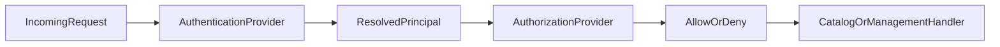

# Security Overview

Kasanari separates security into two layers:

- **Authentication**: who the caller is.
- **Authorization**: what the caller can do.

Both layers are pluggable via SPI and configured independently.

## Configuration entry points

- Authentication provider selection: `kasanari.authentication.type`
- Authorization provider selection: `kasanari.authorization.type`

## Built-in providers

- Authentication: `none`, `ldap`, `oidc`
- Authorization: `allow-all`, `casbin`

## Request flow

## Public endpoints

When authentication is enabled, these paths remain public:

- `/q/health`
- `/q/openapi`
- `/docs`

## Where to go next

- Authentication setup and provider details: `security/authentication.md`
- Authorization provider details: `security/authorization.md`
- RBAC roles and permission matrix: `security/rbac.md`
